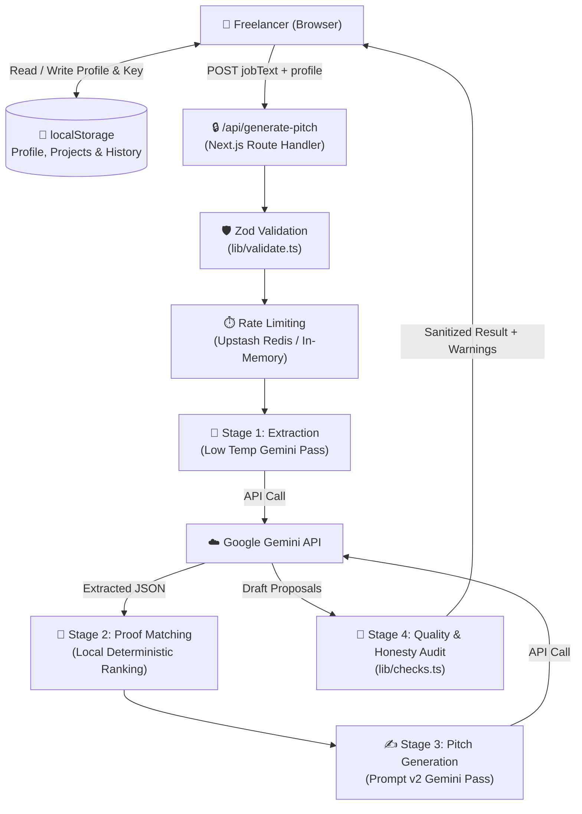

# UpPitch 🚀

**AI-powered proposal and outreach engine for freelancers, contractors, and agencies.**

UpPitch converts client job postings (Upwork, Cold Email, LinkedIn InMail, Twitter/X) into high-converting, problem-first proposals in seconds. Unlike generic AI wrappers that hallucinate fake experience or open with robotic pleasantries, UpPitch pairs verified case studies from your personal **Project Bank** directly with the client's technical bottlenecks.

---

## 📸 Screenshots

<!-- Replace with production product screenshot / GIF demo -->
```
+-----------------------------------------------------------------------+
|  [ UpPitch Workspace ]                                                |
|  +---------------------------------+  +----------------------------+  |
|  | 1. Paste Job Post Brief         |  | 2. Generated Proposals     |  |
|  | [ Client job posting details ]  |  | [ Variation A (Fix Plan) ] |  |
|  |                                 |  | [ Variation B (Loom Call)] |  |
|  | Match verified case studies:    |  | Matched Proof Tags:        |  |
|  | [*] Stripe Concurrent Mutex Fix |  | [*] 0.8s query latency     |  |
|  +---------------------------------+  +----------------------------+  |
+-----------------------------------------------------------------------+
```

---

## 🛠 Tech Stack

- **Framework**: Next.js 15 (App Router, React 19)
- **Language**: TypeScript (Strict Mode)
- **Styling**: Tailwind CSS 4
- **Icons**: Lucide React
- **AI Engine**: Google Gemini API (Structured JSON Mode, Multi-Stage Pipeline)
- **Validation**: Zod (Zero untrusted data passthrough)
- **Rate Limiting**: Upstash Redis (Sliding-window with in-memory fallback)
- **Testing**: Vitest (Unit tests for checks, ranking, validation, and storage migrations)
- **Deployment**: Vercel

---

## 🏗 Architecture Diagram



---

## 🚀 Quick Start & Local Setup

### Prerequisites
- Node.js 20+
- npm 10+
- Google Gemini API key ([Google AI Studio](https://aistudio.google.com/app/apikey))

### 1. Clone & Install
```bash
git clone https://github.com/HammuDev/upPitch.git
cd upPitch
npm install
```

### 2. Configure Environment Variables
Copy `.env.example` to `.env.local`:
```bash
cp .env.example .env.local
```

Edit `.env.local` with your configuration:
```env
GEMINI_API_KEY=your_gemini_api_key_here
NEXT_PUBLIC_SITE_URL=http://localhost:3000
```

### 3. Start Development Server
```bash
npm run dev
```
Open [http://localhost:3000](http://localhost:3000) in your browser.

---

## ⚙️ Environment Variables

| Variable | Required | Description | Default |
| :--- | :---: | :--- | :--- |
| `GEMINI_API_KEY` | Yes (Server) | Server-side Google Gemini API key. Optional if user brings own key in UI. | `undefined` |
| `GEMINI_MODEL` | No | Primary Gemini model ID for extraction and proposal synthesis. | `gemini-1.5-flash` |
| `GEMINI_FALLBACK_MODEL` | No | Fallback Gemini model invoked if primary hits rate limits or 5xx. | `gemini-1.5-flash-8b` |
| `UPSTASH_REDIS_REST_URL` | No | Upstash Redis REST URL for distributed rate limiting. | `undefined` (in-memory) |
| `UPSTASH_REDIS_REST_TOKEN`| No | Upstash Redis REST token for rate limiting authentication. | `undefined` |
| `NEXT_PUBLIC_SITE_URL` | No | Canonical public domain used for sitemap, robots, and OpenGraph. | `https://uppitch.vercel.app` |

---

## 📜 Available Scripts

| Command | Description |
| :--- | :--- |
| `npm run dev` | Runs the Next.js local development server on port 3000. |
| `npm run build` | Compiles the production build with typechecking and static page generation. |
| `npm run start` | Starts the production server. |
| `npm run lint` | Runs ESLint checks using `next/core-web-vitals` rules. |
| `npm run typecheck`| Runs TypeScript compiler type verification (`tsc --noEmit`). |
| `npm test` | Runs the Vitest unit test suite. |

---

## 🔐 Security & Privacy Architecture

- **Zero Database Persistence**: UpPitch does not store job postings, proposals, or freelancer profiles in any database.
- **Client-Side Storage**: Profile details, project case studies, and generation history remain stored locally on your device in browser `localStorage`.
- **Bring-Your-Own-Key (BYOK)**: Custom Gemini API keys entered into Settings remain in local browser storage and are only sent in encrypted HTTPS headers during generation calls.
- **Strict Input Validation**: All incoming API requests are validated and sanitized via Zod to prevent prompt injection and payload flooding.
- **Abuse Prevention**: Sliding-window rate limiting protects the API route against spam and denial-of-service attempts.
- **Hardened HTTP Headers**: Production responses enforce strict Content Security Policy (`CSP`), `HSTS`, `X-Content-Type-Options: nosniff`, `X-Frame-Options: DENY`, and privacy-preserving `Referrer-Policy`.

---

## 🚢 Deployment on Vercel

1. Push your repository to GitHub.
2. Import the repository into [Vercel](https://vercel.com).
3. Configure the following Environment Variables in your Vercel Project Settings:
   - `GEMINI_API_KEY`: Your production Gemini API key.
   - `GEMINI_MODEL`: `gemini-1.5-flash` (or your preferred model ID).
   - `GEMINI_FALLBACK_MODEL`: `gemini-1.5-flash-8b`.
   - `UPSTASH_REDIS_REST_URL`: (Recommended) Upstash Redis endpoint for serverless rate limiting.
   - `UPSTASH_REDIS_REST_TOKEN`: (Recommended) Upstash Redis token.
   - `NEXT_PUBLIC_SITE_URL`: Your production custom domain (e.g., `https://yourdomain.com`).
4. Click **Deploy**.

---

## 🧪 Testing

```bash
# Run unit tests
npm test

# Run TypeScript verification
npm run typecheck

# Run linter
npm run lint

# Run full production build
npm run build
```

---

## 🗺 Roadmap

- [ ] **Proposal Fit Score**: Automated "Should I Bid?" score analyzing client budget, payment verification, and skill overlap.
- [ ] **Follow-Up Generator**: Contextual follow-up messages for unread proposals and active client interviews.
- [ ] **Won / Lost Outcome Tracking**: Tag saved proposals with outcome status to analyze which project proof hooks convert best.
- [ ] **Programmatic SEO Landing Pages**: Targeted sub-pages for `/upwork-cover-letter-generator` and `/cold-email-pitch-generator`.
- [ ] **CSP Report-Only Monitoring**: Observability telemetry for CSP violation tracking.

---

## 📄 License & Attribution

MIT License. Built with ❤️ for freelancers by Hammad.
